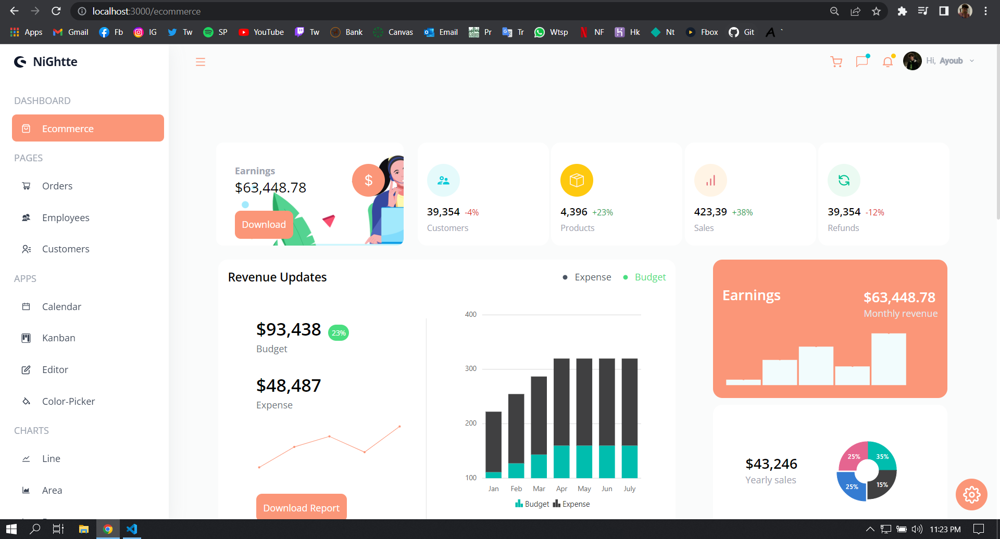

# Business Application ('NiGhtte' is my Gamer tag :D)

##### View -> https://nightte-business-app.vercel.app/

## An advanced business app using React and Tailwind.

### You can view all different charts and components made by Syncfusion libraries.

To use you need to:

1- Clone or Download this repository

2- Have node.js pre-installed in you computer

3- Launch your IDE and cd into the projct

4- Install tailwindcss as a developement dependency: `yarn add -D tailwindcss`

5- open terminal and run:

##### - `npm or yarn install` to install node modules

##### - `npm or yarn start` to open developement at localhost:3000

#### View -> https://nightte-business-app.vercel.app/
